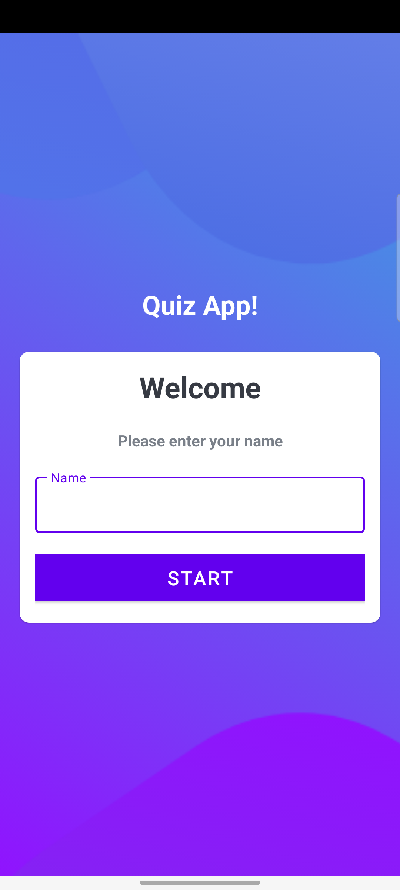
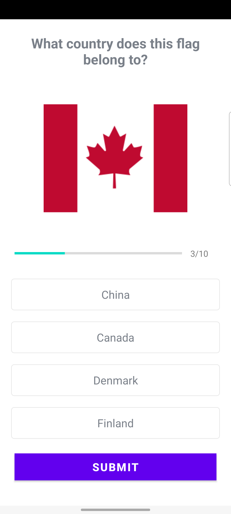
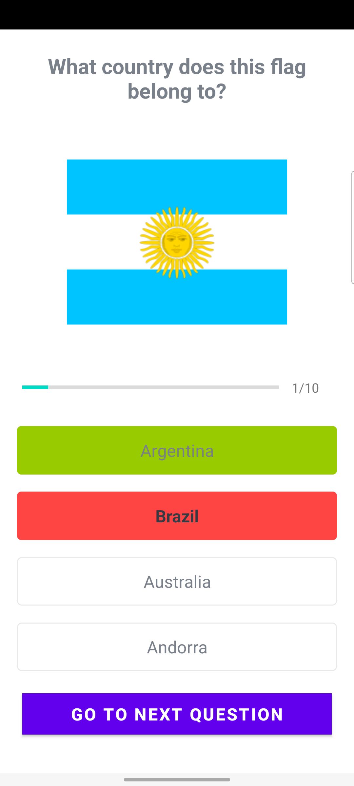

<h4 align="center">
  QuizApp
</h4>

  <a href="#rocket-tecnologias">Technologies</a>&nbsp;&nbsp;&nbsp;|&nbsp;&nbsp;&nbsp;
  <a href="#-project">Project</a>

 

  

## :rocket: Technologies

- [Kotlin](https://kotlinlang.org/)

- [Android Studio](https://developer.android.com/studio?hl=pt&gclid=Cj0KCQjw1vSZBhDuARIsAKZlijQdCFfx4HCJJIgOwzPrkBqaXoGvx1mzBb43P9e_iOwU_XxVDyWuM4gaAgaREALw_wcB&gclsrc=aw.ds)

- [Linear Layout](https://developer.android.com/guide/topics/ui/layout/linear?hl=pt-br)

## 💻 Project

Quiz App to check your knowledge about some flags of some countries

  
   
    
     

